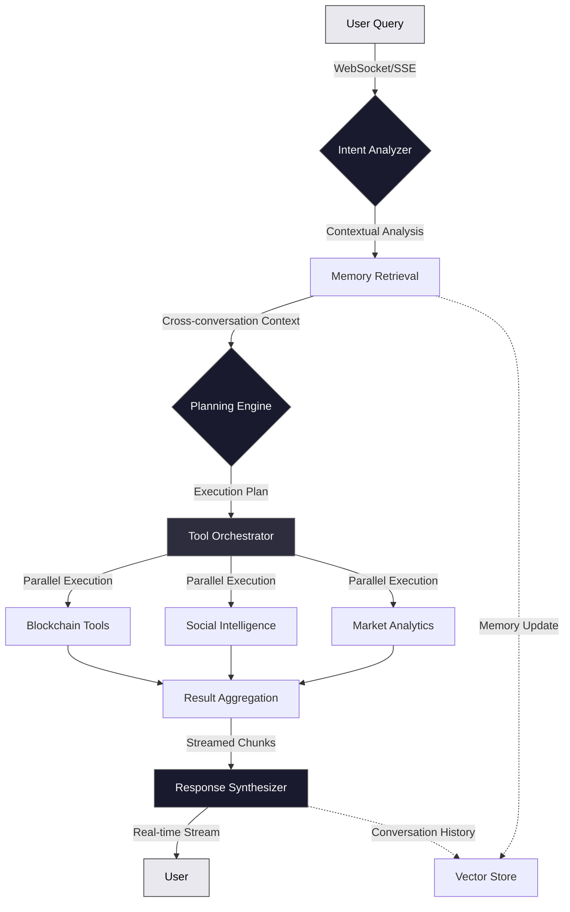
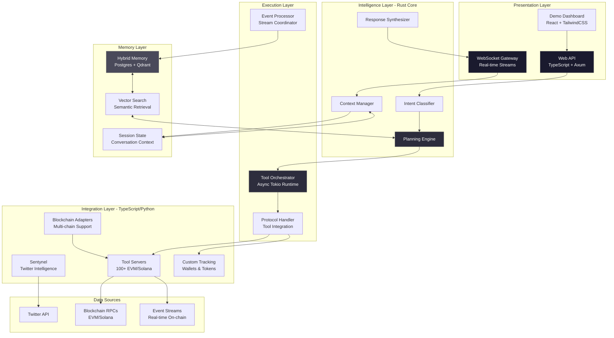
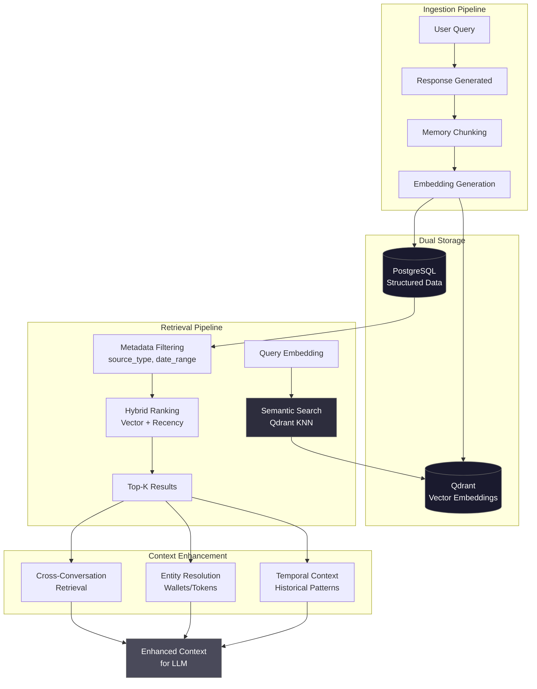
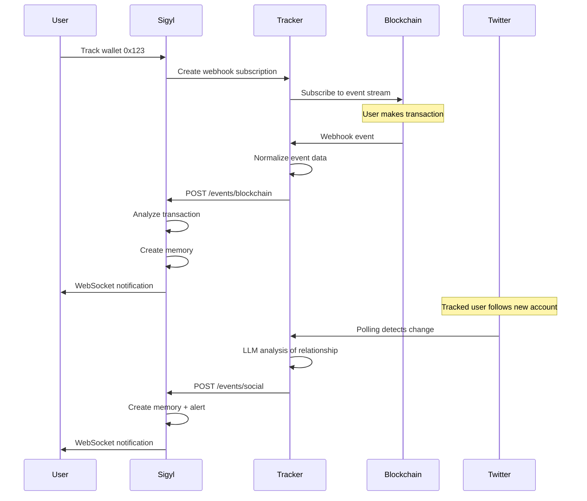

<div align="center">

<!-- Metallic Grey Gradient Header -->
<picture>
  
</picture>

<br/>

<!-- Tech Stack Badges -->
### Core Languages & Frameworks


### AI & LLM Infrastructure


### Databases & Storage


### Rust Stack


### TypeScript/JavaScript Stack


### Python Stack


### Infrastructure


### Status


</div>

---

## Meet Sigyl


**Sigyl is a Crypto AI layer** that understands your questions about blockchains, market data, and social signals. Using advanced multi-stage language model pipelines, it can *analyze*, *track*, and *explain* complex crypto market dynamics in real-time.

Behind the scenes, Sigyl is powered by a **high-performance multi-language stack**—Rust for the core engine, TypeScript for real-time services, and Python for specialized analytics. Our intelligent pipeline understands intent, retrieves cross-conversation context from hybrid memory systems, and coordinates **100+ specialized blockchain tools**, delivering insights with streaming responses.

---

## Query Processing & Streaming Pipeline

<div align="center">



</div>

### How It Works

1. **Intent Understanding** - Multi-layer semantic analysis that understands crypto terminology, entity resolution, and query complexity patterns
2. **Cross-Conversation Memory** - Hybrid vector + relational memory retrieves relevant context across all user sessions, not just current conversation
3. **Intelligent Planning** - Dynamic execution planner decomposes complex queries into parallel tool invocations with dependency resolution
4. **Streaming Execution** - Server-Sent Events (SSE) stream responses in real-time as tools execute, providing immediate feedback
5. **Tool Orchestration** - 100+ blockchain tools execute in parallel, enabling composable multi-chain queries
6. **Context-Aware Synthesis** - Final response incorporates retrieved memories, real-time data, and conversation flow for coherent answers

---

## System Architecture

<div align="center">



</div>

---

## Technology Stack

<div align="center">

| Layer | Technologies | Purpose | Performance |
|-------|-------------|---------|-------------|
| **Frontend** | React, TailwindCSS, WebSocket | Interactive dashboard | Real-time updates |
| **API Gateway** | Axum (Rust), TypeScript Adapters | HTTP/WebSocket routing | <50ms overhead |
| **Core Engine** | Rust + Tokio async runtime | High-performance orchestration | Concurrent 100+ users |
| **Intelligence** | Multi-stage LLM pipeline | Intent → Planning → Synthesis | <5s end-to-end |
| **Memory** | PostgreSQL + Qdrant Vector DB | Hybrid relational + semantic search | <500ms retrieval |
| **Tool Integration** | Custom protocol handlers | 100+ blockchain tools | Parallel execution |
| **Event Processing** | TypeScript + Python services | Real-time blockchain/social events | 24/7 monitoring |
| **Tracking** | Sentynel (Rust), Event Streams | Wallet/token/Twitter tracking | Sub-second updates |

</div>

### Core Components

```rust
// Production query processing with streaming and memory
async fn process_crypto_query(
    query: UserQuery,
    user_id: Uuid,
    conversation_id: Option<Uuid>,
) -> Result<StreamResponse> {
    // 1. Retrieve cross-conversation context from hybrid memory
    let relevant_memories = memory_store
        .search_across_conversations(user_id, &query.text, limit: 5)
        .await?;

    // 2. Analyze intent with conversation history
    let intent = intent_classifier
        .analyze(&query, &relevant_memories)
        .await?;

    // 3. Generate execution plan with dependencies
    let plan = planning_engine
        .create_execution_plan(&intent, &relevant_memories)
        .await?;

    // 4. Execute tools in parallel via protocol handlers
    let tool_results = tool_orchestrator
        .execute_parallel(&plan.tool_calls)
        .await?;

    // 5. Stream response synthesis in real-time
    let response_stream = response_synthesizer
        .synthesize_streaming(&tool_results, &relevant_memories)
        .await?;

    // 6. Update memory with new conversation turn
    memory_store
        .create_memory(&query, &response_stream, conversation_id)
        .await?;

    Ok(response_stream)
}
```

---

## Advanced Memory System

<div align="center">



</div>

**Key Features:**

- **Cross-Conversation Retrieval** - Semantic search across all user conversations, not just current session
- **Hybrid Storage** - PostgreSQL for structured data + Qdrant for 1536-dimensional embeddings
- **Smart Filtering** - Filter by source type (conversation/event/tracking), date ranges, entity types
- **Sub-500ms Retrieval** - Optimized vector search with metadata pre-filtering
- **Automatic Summarization** - Long-term memories condensed for efficient context injection
- **Entity Tracking** - Wallet addresses, tokens, and Twitter handles linked across memories

---

## Blockchain Tool Ecosystem

<div align="center">

| Tool Category | Blockchain Support | Capabilities | Tool Count |
|---------------|-------------------|--------------|------------|
| **EVM Chains** | Ethereum, Polygon, BSC, Arbitrum, Base | Token prices, balances, transfers, NFTs, DeFi protocols | 50+ tools |
| **Solana** | Mainnet, Devnet | SPL tokens, Raydium, Jupiter, wallet analysis | 30+ tools |
| **Market Data** | Multi-chain | OHLCV data, liquidity pools, trading volume, pair discovery | 10+ tools |
| **Wallet Tracking** | All chains | Real-time monitoring, P&L tracking, portfolio analysis | Custom |
| **Token Intelligence** | All chains | Price alerts, holder distribution, transfer patterns | Custom |
| **Social Signals** | Twitter | Following detection, sentiment analysis, influencer tracking | Custom |

</div>

**Tool Orchestration Architecture**

Sigyl's proprietary tool system enables:

- **Stateless Design** - Tools exposed as pure functions with JSON schemas for type safety
- **Parallel Execution** - Multiple tools execute concurrently across different blockchains
- **Error Resilience** - Failed tool calls don't crash the query pipeline; graceful degradation
- **Dynamic Composition** - Complex queries automatically decomposed into optimal tool sequences
- **Multi-chain Support** - Unified interface across EVM and Solana ecosystems

**Composability Example:**
```typescript
// Complex query automatically decomposed into parallel tool calls
query: "Compare profitability of wallet A and B on Ethereum"

execution_plan: [
  // Parallel execution across our blockchain tools
  { tool: "eth_wallet_pnl", args: { address: "0x...A", chain: "eth" } },
  { tool: "eth_wallet_pnl", args: { address: "0x...B", chain: "eth" } },
  { tool: "eth_token_balances", args: { address: "0x...A" } },
  { tool: "eth_token_balances", args: { address: "0x...B" } },
  { tool: "eth_transaction_history", args: { address: "0x...A" } },
  { tool: "eth_transaction_history", args: { address: "0x...B" } },

  // Results aggregated and synthesized into comprehensive response
]
```

---

## Real-Time Event Processing

<div align="center">



</div>

**Event Sources:**
- **Blockchain Transactions** - Real-time webhooks for on-chain events across all supported chains
- **Token Transfers** - ERC-20, SPL, and native token movements
- **Social Signals** - Twitter following changes with intelligent relationship analysis
- **Price Movements** - Token price alerts from tracked holdings
- **DeFi Activity** - DEX swaps, liquidity changes, staking events

**Processing Pipeline:**
1. **Event Normalization** - Sentynel services normalize diverse event formats into unified schema
2. **Intelligence Layer** - LLM-based analysis determines significance and contextual relationships
3. **Memory Creation** - High-signal events stored as searchable memories for future retrieval
4. **Alert Generation** - User notifications via WebSocket for time-sensitive events

---

## Design Principles

<div align="center">

### **Performance-First**
Rust core + async Tokio runtime enables 100+ concurrent users with sub-5s query latency

### **Safety & Reliability**
Type-safe Rust prevents memory errors, with comprehensive error handling across the pipeline

### **Observability**
Distributed tracing and structured logging provide full visibility into query execution paths

### **Composability**
Modular tool architecture enables seamless integration of new capabilities without core changes

### **Scalability**
Stateless architecture + connection pooling + vector search optimizations support production workloads

</div>

---

## Our Vision

> **A world where anyone can query blockchains in natural language**

We're building the infrastructure for:
- **Natural language blockchain interactions** - Ask questions, get insights, no technical barriers
- **Autonomous AI agents** - Machine agents that can analyze markets, track wallets, and execute strategies
- **Open tool ecosystem** - Extensible protocol enabling third-party tool integrations
- **Cross-chain intelligence** - Unified interface across EVM, Solana, and future chains

---

## Get Started

<div align="center">

### Try Sigyl Today

[](https://www.sigyl.ai/demo)

### Learn More

[](https://sigyl.ai)
[](https://linktr.ee/sigylai)

</div>

---

<div align="center">

### Further Reading

Dive deeper into Sigyl's architecture and vision:

[](https://sigyl.ai/articles)
[](https://sigyl.ai/whitepaper)

<br/>

**© 2025 SIGYL**

</div>
