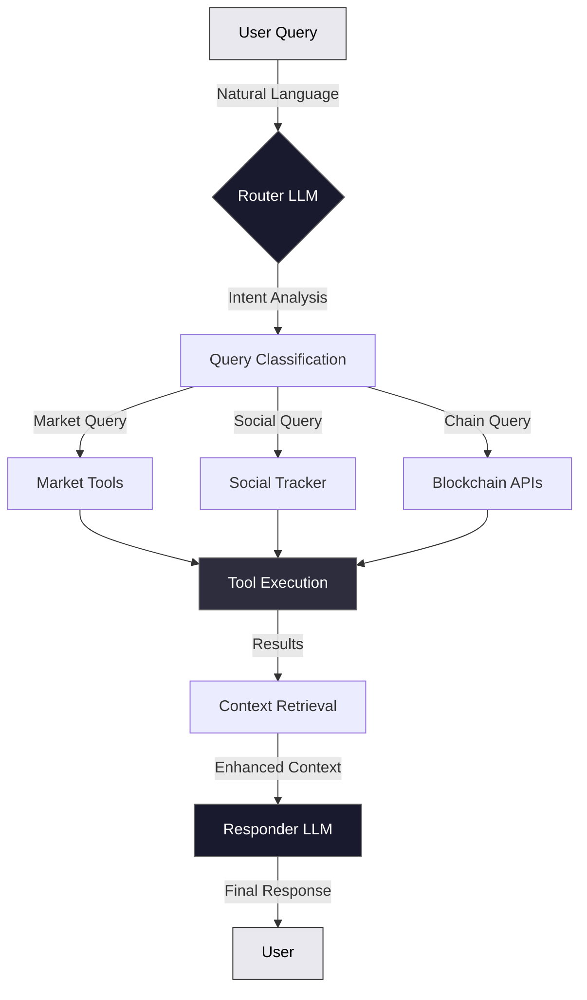
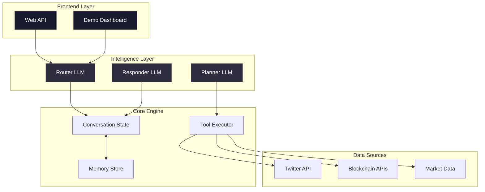
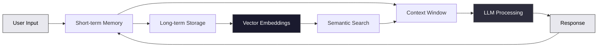

<div align="center">

<!-- Metallic Grey Gradient Header -->
<picture>
  
</picture>

<br/>

<!-- Status Badges -->


</div>

---

## Meet Sigyl


**Sigyl is a Crypto AI layer** that understands your questions about blockchains, market data, and social signals. Using advanced language models, it can *analyze*, *track*, and *explain* complex crypto market dynamics in seconds.

Behind the scenes, Sigyl is powered by a **high-performance Rust backend**. Our intelligent pipeline understands your intent, retrieves relevant context from memory systems, and coordinates specialized blockchain tools, delivering insights faster than traditional platforms.

---

## Query Processing & LLM Pipeline

<div align="center">


```mermaid
flowchart TD
    A[User Query] -->|Natural Language| B{Router LLM}
    B -->|Intent Analysis| C[Query Classification]
    C -->|Market Query| D[Market Tools]
    C -->|Social Query| E[Social Tracker]
    C -->|Chain Query| F[Blockchain APIs]
    
    D --> G[Tool Execution]
    E --> G
    F --> G
    
    G -->|Results| H[Context Retrieval]
    H -->|Enhanced Context| I[Responder LLM]
    I -->|Final Response| J[User]
    
    style A fill:#e8e8ee,stroke:#333,color:#000
    style J fill:#e8e8ee,stroke:#333,color:#000
    style B fill:#1a1a2e,stroke:#666,color:#fff
    style I fill:#1a1a2e,stroke:#666,color:#fff
    style G fill:#2d2d3d,stroke:#666,color:#fff
```

</div>

### How It Works

1. **Intent Understanding** - Advanced NLP that understands crypto terminology and complex queries
2. **Intelligent Routing** - Smart system determines the best way to get accurate answers quickly  
3. **Parallel Execution** - Multiple blockchain queries and data retrievals run simultaneously
4. **Context-Aware Responses** - Leverages conversation history and market context for intelligent answers

---

## System Architecture

<div align="center">


```mermaid
graph TB
    subgraph "Frontend Layer"
        A1[Web API]
        A2[Demo Dashboard]
    end
    
    subgraph "Intelligence Layer"
        B1[Router LLM]
        B2[Planner LLM]
        B3[Responder LLM]
    end
    
    subgraph "Core Engine"
        C1[Conversation State]
        C2[Memory Store]
        C3[Tool Executor]
    end
    
    subgraph "Data Sources"
        D1[Twitter API]
        D2[Blockchain APIs]
        D3[Market Data]
    end
    
    A1 --> B1
    A2 --> B1
    
    B1 --> C1
    B2 --> C3
    B3 --> C1
    
    C1 <--> C2
    C3 --> D1
    C3 --> D2
    C3 --> D3
    
    style A1 fill:#1a1a2e,stroke:#666,color:#fff
    style A2 fill:#1a1a2e,stroke:#666,color:#fff
    style B1 fill:#2d2d3d,stroke:#666,color:#fff
    style B2 fill:#2d2d3d,stroke:#666,color:#fff
    style B3 fill:#2d2d3d,stroke:#666,color:#fff
```

</div>

---

## Technology Stack

<div align="center">

| Layer | Technology | Purpose | Performance |
|-------|------------|---------|-------------|
| **Interface** | Web API, React Dashboard | Multiple entry points | <100ms response |
| **Intelligence** | Multi-stage LLM Pipeline | Query routing & response | <5s typical query |
| **Core** | Rust + Tokio | High-performance runtime | Concurrent operations |
| **Memory** | PostgreSQL + Vector DB | Context & embeddings | Multi-session history |
| **Integration** | REST APIs + WebSockets | Real-time data streams | 24/7 monitoring |

</div>

### Core Components

```rust
// Simplified view of Sigyl's query processing
async fn process_crypto_query(query: UserQuery) -> Response {
    // Understand what the user is asking about
    let intent = analyze_intent(&query).await?;
    
    // Retrieve relevant context and market data
    let context = gather_context(&intent).await?;
    
    // Execute necessary blockchain/market queries
    let data = execute_tools(&intent, &context).await?;
    
    // Generate intelligent response
    generate_response(&data).await
}
```

---

## Memory System

<div align="center">


```mermaid
graph LR
    A[User Input] --> B[Short-term Memory]
    B --> C[Context Window]
    C --> D[LLM Processing]
    
    B --> E[Long-term Storage]
    E --> F[Vector Embeddings]
    F --> G[Semantic Search]
    G --> C
    
    D --> H[Response]
    H --> B
    
    style A fill:#e8e8ee,stroke:#333,color:#000
    style H fill:#e8e8ee,stroke:#333,color:#000
    style D fill:#2d2d3d,stroke:#666,color:#fff
    style F fill:#1a1a2e,stroke:#666,color:#fff
```

</div>

- **Conversational Context** - Maintains context across sessions
- **Semantic Search** - Understands context and finds relevant information
- **Fast Recall** - Recent interactions in memory for instant access
- **Historical Analysis** - Indexed data for pattern recognition

---

## Tool Ecosystem

<div align="center">

| Tool Category | Capabilities | Use Cases |
|--------------|--------------|-----------|
| **Market Analysis** | Token prices, volume, liquidity | Price tracking, market trends |
| **Trade Tracking** | DEX swaps, wallet activity | Whale watching, trade alerts |
| **Profitability** | P&L analysis, yield tracking | Portfolio performance |
| **Social Sentiment** | Twitter monitoring, trend analysis | Market sentiment, influencer tracking |
| **Chain Data** | On-chain metrics, gas analysis | Network health, activity monitoring |

</div>

Each tool is **optimized for specific crypto use cases** and can be **composed together** for complex queries. The modular architecture enables rapid integration of new capabilities.

---

## Design Principles

<div align="center">

### **Safety-First**
Built with Rust for reliability and performance, ensuring safe execution across multiple blockchains

### **Observability**
Comprehensive monitoring and tracing throughout the system for full transparency

### **Composability**
Modular architecture designed for extensibility - new capabilities integrate seamlessly

</div>

---

## Our Vision

> **A world where anyone can query blockchains in natural language**

We're building the infrastructure for:
- Natural language blockchain interactions
- Machine agents collaborating on DeFi operations
- An open ecosystem of specialized AI tools

---

## Get Started

<div align="center">

### Try Sigyl Today

[](https://www.sigyl.ai/demo)

### Learn More

[](https://sigyl.ai)
[](https://linktr.ee/sigylai)

</div>

---

<div align="center">
  
### Further Reading

Dive deeper into Sigyl's architecture and vision:

[](https://sigyl.ai/articles)
[](https://sigyl.ai/whitepaper)

<br/>

**© 2025 SIGYL AI**

</div>
